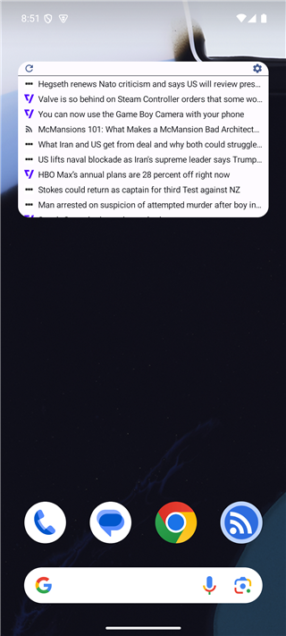
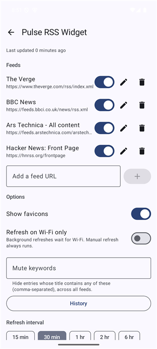
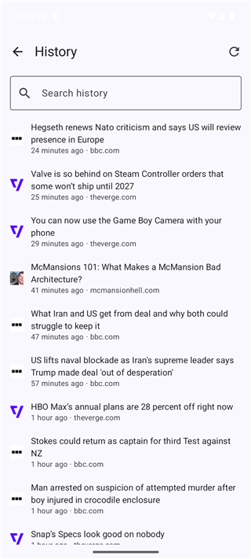

# Pulse RSS Widget

A lightweight, focused Android **home-screen widget** for RSS / Atom feeds. It shows a dense, single-line, title-only feed merged from all your sources — glanceable, resizable, and deliberately minimal. No accounts, no tracking, no in-app reader bloat.


-blue)


| Home-screen widget | Settings | History |
|---|---|---|
|  |  |  |

---

## Why

Most RSS apps want to be a reader. This one wants to be a **widget** — a tiny, always-visible headline ticker on your home screen. Tap a headline to open it; everything else stays out of the way. The companion app exists only to manage feeds and browse a searchable history.

## Features

**Widget**
- Dense, single-line, title-only rows — merged newest-first across all feeds
- Freely **resizable** in both dimensions; row count fills the height (capped at 50)
- **Favicons** in front of each entry, based on the *article's* link domain (so a link aggregator shows the linked site's icon)
- Tap a row to open the article — uses Android's standard link routing, so links open in their app (Reddit, YouTube, …) if you've set that app to handle them
- Refresh button with a progress overlay
- **Material You** dynamic theming (light/dark, wallpaper colors on Android 12+)

**Feeds**
- Add by URL (or auto-prepend `https://`), remove, enable/disable
- **Custom title** per feed
- **Per-feed keyword filter** (allow-list): only keep entries whose title contains one of your terms
- **Global mute keywords** (deny-list): hide entries containing those words across *all* feeds
- **Failed-feed indicator** — flags a feed only after repeated failures, so a transient blip doesn't cry wolf
- **Share-to-add**: share a link from any app to Pulse to add it as a feed

**History & refresh**
- Deduplicated history of the last **1000** entries, with **search**, pull-to-refresh, and long-press-to-share
- Background refresh via WorkManager at a configurable interval (15 min – 6 h), with a **Wi-Fi-only** option
- **Conditional requests** (ETag / If-Modified-Since) to skip unchanged feeds
- Honors **`Retry-After`** so rate-limited feeds (e.g. Reddit) get backed off instead of hammered
- **Backup / restore** your whole setup to a JSON file (feeds, filters, mute list, settings) via the system file picker — no storage permission needed

## Tech

Deliberately small dependency surface:

- **Kotlin**, single module
- **Jetpack Glance** for the app widget; **Compose Material 3** for the settings/history screens
- **WorkManager** for background refresh
- **OkHttp** for fetching; the platform **`XmlPullParser`** for RSS 2.0 + Atom (no parser library)
- **DataStore (Preferences)** for storage; favicons cached as files on disk
- `org.json` for (de)serialization — no reflection-based JSON

No Room, no Gson/Moshi, no image-loading library.

## Build

Requirements: **JDK 17** and the **Android SDK (API 35)**.

```bash
# clone, then:
./gradlew assembleRelease
# output: app/build/outputs/apk/release/Pulse-RSS-Widget-1.0-release.apk
```

Or just open the project in **Android Studio** (it provisions the SDK and you can Run/Build from there).

### Signing

The release build signs with a local keystore at `app/pulse.keystore` **if present** — and that file is `.gitignore`d, so it never lands in the repo. A fresh clone without the keystore still builds; it just produces an *unsigned* release you sign with your own key:

```bash
keytool -genkeypair -v -keystore app/pulse.keystore -alias pulse \
  -keyalg RSA -keysize 2048 -validity 10000
```

Override the passwords without touching source via Gradle properties: `-PPULSE_STORE_PASSWORD=… -PPULSE_KEY_PASSWORD=… -PPULSE_KEY_ALIAS=…`.

## Install

1. Sideload the APK (enable "install unknown apps" for your file manager), **or** `adb install app-release.apk`.
2. Long-press the home screen → **Widgets** → **Pulse RSS Widget** (or open the app and tap **"Add widget to home screen"**).
3. Open settings (the ⚙ on the widget), add feed URLs, and you're set.

## Project layout

```
app/src/main/java/com/pulse/rsswidget/
├─ data/      Models, SettingsStore (DataStore), RssParser, FaviconStore, FeedRepository
├─ work/      RefreshWorker + RefreshScheduler (WorkManager)
├─ widget/    PulseWidget (Glance), receiver, refresh action
└─ ui/        Settings / Feed editor / History (Compose), shared theme
```

## Non-goals

Kept out on purpose, to stay a *widget* and not become a reader: notifications / unread counts, an in-app article reader, multiple categorized widgets, and accounts / cloud sync.

## License

Released under the [MIT License](LICENSE) — do what you want with it, just keep the copyright notice. The copyright line currently reads "Pulse RSS Widget contributors"; change it to your own name if you'd prefer.
