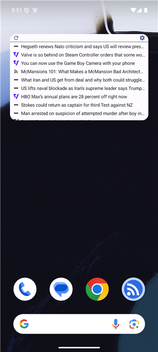
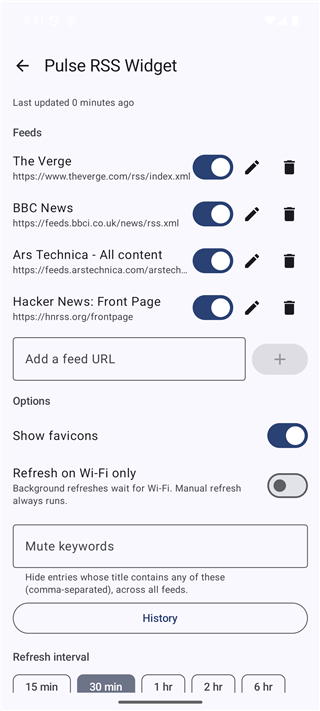
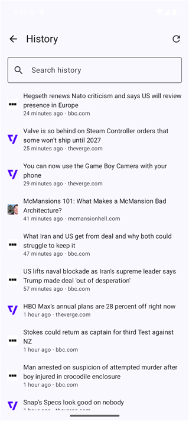

# Pulse RSS Widget

An Android home-screen widget for RSS and Atom feeds. It merges all your feeds into one dense list of single-line headlines that you can resize to fit. No accounts, no tracking, no in-app reader bloat.


-blue)


| Home-screen widget | Settings | History |
|---|---|---|
|  |  |  |

---

## Why

Most RSS apps want to be a reader. This one wants to be a widget, a tiny headline ticker that's always visible on your home screen. Tap a headline to open it; everything else stays out of the way. The companion app exists only to manage feeds and browse a searchable history.

## Features

**Widget**
- Single-line, title-only rows from all your feeds, newest first
- Resizable in both directions; the row count follows the height, up to 50
- A favicon before each entry, taken from the article's own domain, so a link aggregator shows the linked site's icon instead of its own
- Tap a row to open the article. Links go through Android's normal link handling, so they open in their app (Reddit, YouTube, …) if you've set that app to handle them
- Refresh button with a progress overlay
- Three color styles: Neutral (plain gray with no wallpaper tint, follows light/dark mode), Wallpaper (Material You colors on Android 12+), or Black (pure black for OLED)

**Feeds**
- Add a feed by URL (`https://` is added if you leave it off), remove it, or switch it on and off
- Give any feed a custom title
- A keyword filter per feed shows only entries whose titles contain one of your words
- Global mute words hide matching entries across all feeds
- Both filters only shape the widget; History keeps the full feed
- Pulse flags a feed as failing only after repeated errors, so a one-off blip doesn't cry wolf
- Share a link to Pulse from any app to add it as a feed

**AniList**
- Enter your AniList username, or paste your profile link, to get a row for every new episode of the airing shows on your lists, except the ones you've dropped. There's no login or API key; your list just has to be public.
- Rows read "Title - Episode N" with the AniList icon, mixed in with your feeds by air time. Tapping one opens the show's AniList page.
- It refreshes with your feeds on the normal interval, using two small requests, and covers the last 7 days, including the final episodes of shows that just ended.
- It sits in the feed list like any other feed, so you can turn it off, rename it, or give it a keyword filter to show only certain shows.

**History & refresh**
- History keeps the last 1000 entries, deduplicated and unfiltered, with search, pull-to-refresh, and long-press to share
- Background refresh through WorkManager, every 15 minutes to 6 hours, with a Wi-Fi-only option
- Conditional requests (ETag / If-Modified-Since) skip feeds that haven't changed
- Honors `Retry-After`, so rate-limited feeds like Reddit get backed off instead of hammered
- Back up and restore your whole setup (feeds, filters, mute list, settings) as a JSON file through the system file picker, with no storage permission needed

## Tech

Deliberately small dependency surface:

- Kotlin, single module
- Jetpack Glance for the widget; Compose Material 3 for the settings and history screens
- WorkManager for background refresh
- OkHttp for fetching; the platform `XmlPullParser` for RSS 2.0 and Atom (no parser library)
- AniList's public GraphQL API for the AniList source (a plain OkHttp POST with `org.json`, no client library)
- DataStore (Preferences) for storage; favicons cached as files on disk
- `org.json` for (de)serialization, no reflection-based JSON

No Room, no Gson/Moshi, no image-loading library.

## Build

You need JDK 17 and the Android SDK (API 35).

```bash
# clone, then:
./gradlew assembleRelease
# output: app/build/outputs/apk/release/Pulse-RSS-Widget-1.2.1-release.apk
```

Or open the project in Android Studio, which sets up the SDK and lets you run or build from there.

### Signing

Gradle signs the release build with `app/pulse.keystore` if that file exists. It's in `.gitignore`, so it never lands in the repo. A fresh clone without it still builds, but the release comes out unsigned. To sign it, create your own keystore:

```bash
keytool -genkeypair -v -keystore app/pulse.keystore -alias pulse \
  -keyalg RSA -keysize 2048 -validity 10000
```

To set the passwords and alias without editing the source, pass them as Gradle properties: `-PPULSE_STORE_PASSWORD=… -PPULSE_KEY_PASSWORD=… -PPULSE_KEY_ALIAS=…`.

## Install

1. Sideload the APK (allow "install unknown apps" for your file manager), or run `adb install Pulse-RSS-Widget-<version>-release.apk`.
2. Long-press the home screen → **Widgets** → **Pulse RSS Widget**, or open the app and tap **Add widget to home screen**.
3. Open settings (the ⚙ on the widget), add feed URLs, and you're set.

## Project layout

```
app/src/main/java/com/pulse/rsswidget/
├─ data/      Models, SettingsStore (DataStore), RssParser, AniListSource, FaviconStore, FeedRepository
├─ work/      RefreshWorker + RefreshScheduler (WorkManager)
├─ widget/    PulseWidget (Glance), receiver, refresh action
└─ ui/        Settings / Feed editor / History (Compose), shared theme
```

## Non-goals

Pulse leaves out notifications and unread counts, an in-app article reader, multiple categorized widgets, and accounts or cloud sync. Each of those would push it toward being a reader, and it's meant to stay a widget.

## License

Released under the [MIT License](LICENSE). Do what you want with it; just keep the copyright notice.
